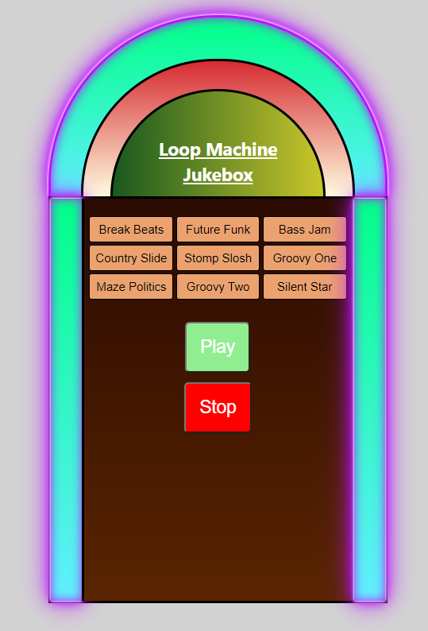

# Jukebox Loop Machine

## Description

Working Jukebox implemented with React and Howler.js for the audio handling.

The Jukebox will run in an infinite accelerating loop until it is stopped.

## Usage

Link to live demo: https://moveo-home-assignment.netlify.app/


### to run on your own computer

After cloning the repo, 

open the terminal and run
```bash
yarn install
```

after that, opening the code in your browser of choice will result in this image:



